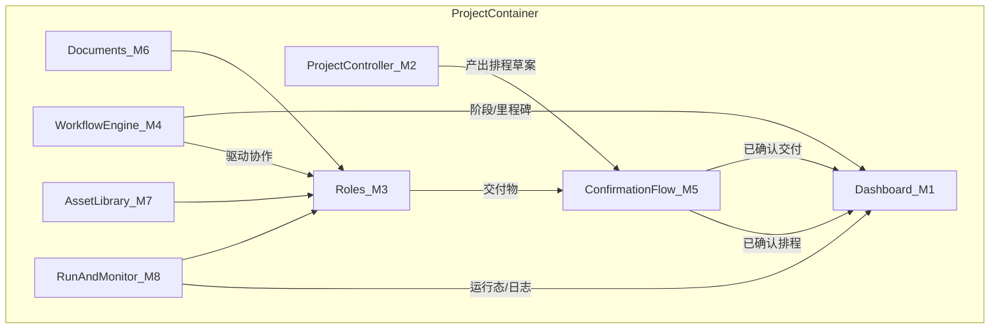

# Agent Flow 产品 Roadmap（本地）

> **用途**：梳理产品内**功能模块**（一级 / 子功能 / 界面路由），分阶段标注 Demo → Beta → GA → Vision；模块确认后再映射到 [project-plan.local.md](./project-plan.local.md) 排工程。  
> **与文档的关系**：叙事与主模型见 [product-brief.local.md](./product-brief.local.md)；本文件管**产品有什么**；工程计划管**怎么落地**。  
> **保密**：已加入 `.gitignore`，勿 push。

**最后更新**：2026-06-02  
**文档状态**：v0.2 · 一级模块与页面清单已确认；页面内细节待设计用例

---

## 0. 范围说明

### 包含

- 产品内所有功能模块与子功能
- 建议界面 / 路由（便于后续排期）
- 阶段标签：**Demo**（拟真静态演示）| **Beta** | **GA** | **Vision**
- 默认演示场景 S1 的模块覆盖矩阵

### 不包含

- 营销站页面（首页、功能介绍 `/projects`、营销路线图 `/workbench`、关于、博客等）
- 具体工期与里程碑（模块全部确认后，在 project-plan 中排）
- 后端 / 真实 AI 实现细节（Beta 以后另议）

### 阶段定义

| 阶段 | 含义 |
|------|------|
| **Demo** | 拟真静态演示站：mock 数据 + 轻量前端交互，无后端 |
| **Beta** | 可登录、可持久化、可真实运行工作流的最小可用产品 |
| **GA** | 稳定版：版本管理、高级运行能力、完善设置 |
| **Vision** | 路线图占位：团队、集成、模板市场等 |

### 路由命名约定

| 前缀 | 用途 |
|------|------|
| 产品内页面 | **路由由工程单独规划**；下文「界面/路由」列为能力备忘，非最终 URL |
| `/projects`、`/workbench` 等 | **营销站**，非本产品模块 |

### 文档粒度（2026-06-02 确认）

- 本 roadmap **以一级模块 + 产品页面清单为主**
- §2 子功能表作**能力备忘**，便于 Beta/Vision 时回溯；**Demo 排期不按子功能拆**
- 页面内具体功能划分、UI 形态、演示场景 mock 内容 → **设计到具体页面时另补**

---

## 1. 产品架构总览

```text
项目 Project（容器）
├── M0  项目容器（列表、切换、设置）
├── 协作底座
│     ├── M6  文档 Documents
│     └── M7  资料库 Asset Library
├── M3  角色 Roles（一等公民 · 可编辑配置包）
├── M4  工作流 Workflow（核心引擎）
├── M2  项目主控 Project Controller（内置角色 · 特殊）
├── M1  Dashboard（主界面 · 概览 Tab）
├── M5  人确认 Confirmation Flow（横切）
├── M8  运行与监控 Run & Monitor
└── M9  账号与项目设置 Account & Settings

远景：M10 Vision（团队、集成、模板市场、API）
```



---

## 2. 产品页面清单（页面级 · 已确认）

Demo 阶段需落地的**产品内页面**（路由待定，工程单独规划）：

| # | 页面 | 对应模块 | 阶段 | 状态 |
|---|------|----------|------|------|
| P-1 | **Dashboard · 概览**（默认 Tab：阶段 + 排程 + 角色卡片） | M1、M2、M3、M5 | Demo | 已确认 |
| P-2 | **工作流**（Tab 或独立页） | M4 | Demo | 已确认 |
| P-3 | **文档**（Tab；列表 + 1 篇 mock 详情） | M6 | Demo | 已确认 |
| P-4 | **资料库**（Tab；列表 + 1 条 mock 详情） | M7 | Demo | 已确认 |
| P-5 | **角色详情** | M3 | Demo | 已确认 |
| P-6 | **确认流 UI**（排程 / 交付；Modal 或 inline，挂接在 P-1/P-5） | M5 | Demo | 已确认 |
| P-7 | **运行日志 / 运行详情**（可选） | M8 | Demo | 已确认（可选） |
| P-8 | **项目列表** | M0 | Beta | 已确认 |
| P-9 | **登录 / 个人设置** | M9 | Beta | 已确认 |
| P-10 | **项目设置** | M0、M9 | Beta | 已确认 |

**默认演示路径**：P-1 Dashboard → P-6 确认 → P-2 工作流 → P-5 角色详情。

---

## 3. 功能模块清单

每个模块字段：**ID · 名称 · 一句话 · 用户价值 · 子功能（备忘） · 依赖 · 阶段 · 状态**

模块级状态：**M0–M10 均已确认**（2026-06-02）。子功能不在此轮逐条签字。

---

### M0 · 项目容器 Project

**一句话**：个人用户的项目入口与切换壳。  
**用户价值**：多项目时快速切换上下文；Demo 阶段 mock 单项目即可。  
**依赖**：无（顶层容器）  
**状态**：已确认

| ID | 子功能 | 说明 | 界面 / 路由 | 阶段 |
|----|--------|------|-------------|------|
| M0.1 | 项目列表 | 个人全部项目入口 | `/app`（Beta） | Beta |
| M0.2 | 项目创建 / 归档 | 新建、重命名、归档 | `/app/[projectId]/settings` 或 Drawer | Beta |
| M0.3 | 项目切换 | 顶部项目选择器 | 产品内全局 Header | Demo（mock 单项目） |

**Demo 最低配**：Header 显示固定项目名（如「竞品分析 · 2026 Q2」），无列表切换。

---

### M1 · Dashboard 概览

**一句话**：主界面驾驶舱——阶段、排程、角色卡片三区域。  
**用户价值**：一眼看清项目节奏、安排与各角色最近交付。  
**依赖**：M2（排程数据）、M3（角色卡片）、M5（确认态展示）  
**来源**：product-brief §3  
**状态**：已确认

| ID | 子功能 | 说明 | 界面 / 路由 | 阶段 |
|----|--------|------|-------------|------|
| M1.1 | Tab 导航壳 | 概览 \| 工作流 \| 文档 \| 资料库 | `/demo/[projectId]` 默认 Tab | Demo |
| M1.2 | 项目阶段方块 | 「项目现在在什么阶段」 | Dashboard 左上 | Demo |
| M1.3 | 排程表（大） | 展示**已确认**排程；待确认草案明显区分 | Dashboard 右上 | Demo |
| M1.4 | 角色卡片列表 | 最近交付、时间、下一步/预计、待确认角标 | Dashboard 下方 | Demo |
| M1.5 | 项目主控卡片 | 特殊卡片；如「排程 v3 · 已确认」 | 同上 | Demo |

**布局**（product-brief §3.1）：

```text
┌─────────────────────────────────────────────────────────┐
│  [ 概览 ] [ 工作流 ] [ 文档 ] [ 资料库 ]                  │
├──────────────┬──────────────────────────────────────────┤
│  项目阶段     │           项目排程表（大）                  │
├──────────────┴──────────────────────────────────────────┤
│  角色卡片 × N（含项目主控）                               │
└─────────────────────────────────────────────────────────┘
```

---

### M2 · 项目主控 Project Controller

**一句话**：内置协调角色，与人对齐后产出并维护项目排程。  
**用户价值**：排程是「共识视图」，不是自动调度引擎；主控负责整理，人负责确认。  
**依赖**：M5（排程确认）、M1（排程展示）  
**来源**：product-brief §1.5  
**状态**：已确认

| ID | 子功能 | 说明 | 界面 / 路由 | 阶段 |
|----|--------|------|-------------|------|
| M2.1 | 主控角色定义 | 内置、不可删；职责 = 对齐目标 + 维护排程 | 角色详情（部分字段只读） | Demo |
| M2.2 | 排程草案生成 | 与人沟通后提出排程草案 | 主控对话 Panel / 排程预览 | Demo（mock）→ Beta |
| M2.3 | 排程确认写入 | 用户 Confirm → 写入「当前排程」 | Dashboard 排程区 + Confirm Modal | Demo |
| M2.4 | 排程历史 | v1 / v2 / v3 版本 | 排程表旁版本切换 | Beta |

**原则**：排程**不替代**工作流执行；工作流定义「怎么协作」，排程回答「人何时该看到什么」。

---

### M3 · 角色 Roles

**一句话**：一等公民的配置包——prompt、知识、交付契约、角色内规范。  
**用户价值**：差异化在「岗位配置 + 交付纪律」，不是单纯连节点。  
**依赖**：M6/M7（知识指针）、M5（交付确认）  
**来源**：product-brief §1.4、§9.2  
**状态**：已确认

| ID | 子功能 | 说明 | 界面 / 路由 | 阶段 |
|----|--------|------|-------------|------|
| M3.1 | 角色列表 | 项目内全部角色 | Dashboard 卡片 / 侧边列表 | Demo |
| M3.2 | 角色详情 · Prompt | 共用 prompt / 行为设定 | `/demo/[projectId]/roles/[roleId]` Tab | Demo |
| M3.3 | 角色详情 · 工作知识 | 文档或指针引用，不必复制全文 | 同上 Tab | Demo |
| M3.4 | 角色详情 · 交付契约 | 交给谁、命名规范、格式约定 | 同上 Tab | Demo |
| M3.5 | 角色详情 · 角色内规范 | 做事标准 | 同上 Tab | Demo |
| M3.6 | 角色 CRUD | 新建 / 复制 / 删除自定义角色 | 角色列表 + 编辑器 | Beta |
| M3.7 | 角色模板库 | 预置 PM、分析师等 | `/app/templates/roles` | Vision |

**Demo 最低配**：≥1 个完整角色详情（建议「分析师」）+ 项目主控只读详情。

---

### M4 · 工作流 Workflow（核心引擎）

**一句话**：角色之间的步骤、触发、产物传递——真正怎么跑。  
**用户价值**：工作流是引擎；Dashboard 不必占最大面积，但必须一键可达编辑。  
**依赖**：M3（角色节点）  
**来源**：product-brief §1.4、§3.3  
**状态**：已确认

| ID | 子功能 | 说明 | 界面 / 路由 | 阶段 |
|----|--------|------|-------------|------|
| M4.1 | 工作流查看 | 步骤 / 节点 / 边的只读视图 | `/demo/[projectId]/workflow` Tab | Demo |
| M4.2 | 工作流编辑 | 步骤顺序、角色交接、触发 | 同上，编辑态 | Demo（静态）→ Beta |
| M4.3 | 阶段 / 里程碑绑定 | 与工作流阶段概念对齐 | 工作流节点属性 | Beta |
| M4.4 | 子流程 / 并行 | 复杂协作 | 画布或步骤树 | Vision |
| M4.5 | 工作流版本 | 草稿 vs 已发布 | 版本切换 | GA |

**与营销文案的差异**：`lib/marketing-data.ts` 仍强调「拖拽画流程图」；product-brief 已定 **角色 > 画布**。Demo 可用**步骤列表**或轻量画布；差异化在角色配置，非纯节点编辑器。见 §5 待决议 #4。

---

### M5 · 人确认 Confirmation Flow（横切）

**一句话**：所有角色（含项目主控）产出均需用户确认后才算正式结果。  
**用户价值**：「AI 协作，人做把关」——避免全自动黑盒叙事。  
**依赖**：贯穿 M1、M2、M3、M4  
**来源**：product-brief §1.6  
**状态**：已确认

| ID | 子功能 | 说明 | 界面 / 路由 | 阶段 |
|----|--------|------|-------------|------|
| M5.1 | 排程确认 | 主控排程草案 → Confirm | Modal / 排程表 inline | Demo |
| M5.2 | 交付物确认 | 任意角色产出 → Confirm | 角色卡片 / 详情页 | Demo |
| M5.3 | 确认后下游驱动 | 确认 → 交付记录 / 传下一角色 / 更新 Dashboard | mock state → 真实逻辑 | Demo → Beta |
| M5.4 | 确认历史 | 谁在何时确认了什么 | 交付物详情侧栏 | Beta |
| M5.5 | 批量确认 / 驳回 | 效率操作 | 同上 | GA |

**Demo 最低配**：至少 1 次「确认排程」+ 1 次「确认某角色交付物」。

---

### M6 · 文档 Documents

**一句话**：项目协作文档，与常见项目平台同类。  
**用户价值**：角色工作知识可 pointer 引用文档，不必复制全文。  
**依赖**：M3（知识引用）  
**状态**：已确认

| ID | 子功能 | 说明 | 界面 / 路由 | 阶段 |
|----|--------|------|-------------|------|
| M6.1 | 文档列表 | 项目文档索引 | `/demo/[projectId]/docs` Tab | Demo（静态列表） |
| M6.2 | 文档查看 / 编辑 | Markdown 或富文本 | 文档详情页 | Beta |
| M6.3 | 角色知识引用 | 角色配置 pointer → 文档 | 角色详情 ↔ 文档 | Beta |

**Demo 深度**：见 §5 待决议 #6（纯列表 vs 可点进一篇 mock）。

---

### M7 · 资料库 Asset Library

**一句话**：数据 / 文件 / 链接仓库。  
**用户价值**：分析类项目的原始资料集中管理，供角色引用。  
**依赖**：M3（知识指针）  
**状态**：已确认

| ID | 子功能 | 说明 | 界面 / 路由 | 阶段 |
|----|--------|------|-------------|------|
| M7.1 | 资料列表 | 数据 / 文件 / 链接 | `/demo/[projectId]/assets` Tab | Demo（静态） |
| M7.2 | 上传与管理 | 文件、标签、搜索 | 资料库页 | Beta |
| M7.3 | 角色引用 | 知识指针 → 资料 | 角色详情 | Beta |

---

### M8 · 运行与监控 Run & Monitor

**一句话**：按工作流触发协作，查看运行态与日志。  
**用户价值**：增强「像在跑」的可信度；出错可定位。  
**依赖**：M4（工作流）、M1（卡片更新）、M5（待确认态）  
**来源**：product-brief §6 增强层  
**状态**：已确认

| ID | 子功能 | 说明 | 界面 / 路由 | 阶段 |
|----|--------|------|-------------|------|
| M8.1 | 启动运行 | 按工作流触发一轮协作 | Dashboard / 工作流页操作 | Demo（mock）→ Beta |
| M8.2 | 运行日志 | 终端风格 I/O、耗时 | 底部 Panel / `.../runs/[runId]` | Demo |
| M8.3 | 运行态卡片更新 | 运行中 → 待确认 | Dashboard 角色卡片 | Demo |
| M8.4 | 重试 / 断点续跑 | 失败恢复 | 运行详情 | GA |
| M8.5 | 可观测性 | Token、成本、成功率 | 分析页 | Vision |

**Demo**：S1 场景第 5 步「运行（可选）」——终端日志 → 卡片出现「待确认」。

---

### M9 · 账号与项目设置 Account & Settings

**一句话**：登录、个人偏好、项目级配置。  
**用户价值**：Beta 起的数据持久化与多项目前提。  
**依赖**：M0  
**状态**：已确认

| ID | 子功能 | 说明 | 界面 / 路由 | 阶段 |
|----|--------|------|-------------|------|
| M9.1 | 登录 / 注册 | 单用户 | `/login` | Beta |
| M9.2 | 个人设置 | 偏好、API Key | `/settings` | Beta |
| M9.3 | 项目设置 | 名称、描述、导出 | `/app/[projectId]/settings` | Beta |

**Demo 阶段**：不做；演示口径为概念演示 / 预约交流。

---

### M10 · 远景模块 Vision

**一句话**：团队、集成、模板、API——路线图占位，近期不主打。  
**用户价值**：回答「以后还能做什么」，不进入 Demo 义务。  
**状态**：已确认

| ID | 模块 | 子功能概要 | 阶段 |
|----|------|------------|------|
| M10.1 | 团队协作 | 多人编辑、评论、RBAC | Vision |
| M10.2 | 外部集成 | Notion、飞书、Slack、Webhook | Vision |
| M10.3 | 模板市场 | 场景工作流 / 角色模板 | Vision |
| M10.4 | API / SDK | 程序化调用 Agent Flow | Vision |

---

## 4. 跨模块能力（横切原则）

| 原则 | 含义 | 涉及模块 |
|------|------|----------|
| **工作流是引擎** | 执行顺序、交接、触发以工作流为准 | M4 → M3、M8 |
| **排程是视图** | 大排程表 primarily 给人看；来自主控产出且经人确认 | M2 → M5 → M1 |
| **人确认产出** | 所有角色交付物需确认后才驱动下游 | M5 → M1、M3、M4 |
| **角色 > 画布** | 差异化在岗位配置与交付纪律 | M3、M4 |
| **Tab 一键可达** | 工作流不必占 Dashboard 最大面积，但标签必须可点入编辑 | M1.1、M4 |

---

## 5. 演示场景 S1 覆盖矩阵

**场景**：个人竞品分析项目（product-brief §7 默认 S1；**详细 mock 内容后续补充**）

| 步骤 | 故事 | 模块 | Demo 必做 |
|------|------|------|-----------|
| 1 | Dashboard：阶段「分析中」；排程已确认；分析师卡片有最近交付 | M1 | 是 |
| 2 | 项目主控：新排程草案 → **用户确认** → 排程表更新 | M2 + M5 | 是 |
| 3 | 分析师：交付 `competitor-matrix-2026-06.md` → **用户确认** → 卡片更新 | M3 + M5 | 是 |
| 4 | 工作流 Tab：展示分析师 → PM 的交接边 | M4 | 是 |
| 5 | 运行（可选）：终端日志 → 卡片「待确认」 | M8 | 可选 |
| — | 文档 / 资料库 Tab 轻量呈现 | M6 + M7 | 轻量静态 |

**默认演示路径**：Dashboard → 确认排程 → 确认交付 → 工作流 → 角色详情。

---

## 6. 待决议项

| # | 问题 | 决议 |
|---|------|------|
| 1 | 「项目主脑」vs「项目主控」 | ✅ **项目主控**（2026-06-02） |
| 2 | 阶段方块与工作流阶段的关系 | 待定；设计到 Dashboard 页面时再定 |
| 3 | 产品内路由前缀 | 工程单独规划页面；本 doc 仅列页面清单（§2） |
| 4 | 工作流 UI 形态 | 待定；设计用例提供后再定 |
| 5 | 首发演示场景 mock 内容 | 待定；S1 竞品分析为方向，细节后续补充 |
| 6 | M6/M7 Demo 深度 | ✅ **列表 + 可点进 1 篇 mock**（2026-06-02） |

---

## 7. 与工程计划的关系

模块与页面已确认，按下列顺序映射到 [project-plan.local.md](./project-plan.local.md) P1（**页面级**，页面内细节随设计补充）：

| 优先级 | 页面 | Roadmap | 工程任务概要 |
|--------|------|---------|--------------|
| P1-a | P-1 Dashboard | M1、M2、M3、M5 | 产品壳 + Tab 导航 + 三区域布局 |
| P1-b | P-6 确认流 | M5 | 排程确认 + 交付确认（挂接 Dashboard / 角色详情） |
| P1-c | P-5 角色详情 | M3 | ≥1 完整角色 mock |
| P1-d | P-2 工作流 | M4 | 工作流页（UI 待设计用例） |
| P1-e | P-3、P-4 文档 / 资料库 | M6、M7 | 列表 + 各 1 条 mock 详情 |
| P1-f | P-7 运行（可选） | M8 | 终端日志 + 待确认卡片态 |

**营销站注意**：

- 当前 [`/workbench`](../app/(public)/workbench/page.tsx) 是**营销路线图页**，不是产品 Dashboard
- 当前 [`/projects`](../app/(public)/projects/page.tsx) 是**功能介绍页**，不是产品内项目列表
- [`lib/marketing-data.ts`](../lib/marketing-data.ts) 功能卡片待与 product-brief v0.2 对齐（project-plan P0/P1）

**Beta 及以后**（不在当前 Demo P1 范围）：M0.1–M0.2、M3.6、M4.2+、M9、M10。

---

## 8. 修订记录

| 日期 | 修订 |
|------|------|
| 2026-06-02 | v0.1 初稿：M0–M10 模块清单、路由建议、S1 矩阵、待决议项 |
| 2026-06-02 | **v0.2** 一级模块与页面清单确认；命名定为「项目主控」；M6/M7 Demo = 列表 + 1 mock；页面内细节/UI/路由待设计阶段补充 |
